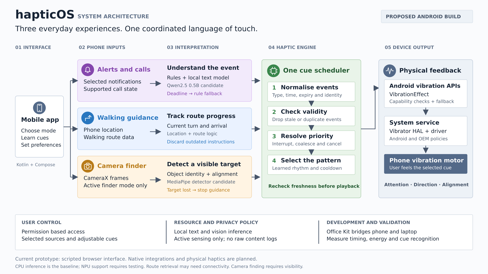

# hapticOS

**Important information, communicated through touch.**

hapticOS explores how a phone can communicate selected alerts, walking directions and camera alignment through a small set of recognisable vibration patterns. The goal is to help people recognise useful events with fewer screen checks.

[Explore the prototype](https://hapticos-concept.rprashasthimmanuel.chatgpt.site) · [Project documentation](docs/PROJECT.md) · [Architecture](docs/ARCHITECTURE.md) · [Run locally](#run-locally)

## Project status

This repository contains a working **clickable concept prototype** built with HTML, CSS and JavaScript. It demonstrates the mobile interface and interaction flows using scripted inputs and animated cue previews.

The prototype does not read notifications or calls, access a camera or location, run an AI model, or produce physical vibration. A native Android implementation is planned. hapticOS is the product name; the proposed implementation is an Android application, not a replacement operating system.

## The idea

An ordinary vibration tells you that something happened. A learned pattern can communicate a little more: a message needs attention, the next turn is right, or the object you are aiming at is centred.

The challenge is consistency. A cue must have a recognisable meaning, arrive while it is relevant, and stop when the underlying event changes. hapticOS combines three experiences around one proposed cue engine that manages these decisions.

### Important alerts and calls

Compare a shopping promotion, a ride arrival message and an incoming call. The promotion stays quiet in the example, the ride message uses two short pulses, and the call has a sustained pulse.

These patterns identify event categories, not the full message or the caller's intent. The native design combines selected notification text, user rules and local classification, with one supported cellular call integration.

### Walking guidance

Step through a sample walk to a café. Separate rhythms represent right turns, left turns and arrival. The map and instruction update together, and the route can be restarted.

The planned app will derive instructions from location and route data. A language model will not decide the route. Left and right are learned rhythms; the motor does not physically push the phone in either direction.

### Camera finder

Move a simulated camera toward a visible bottle. The cue changes as the target approaches the centre. Hide the target to see alignment guidance stop and a distinct loss cue appear.

The planned detector will operate only in finder mode. It cannot see an object hidden under a bed, and image alignment does not establish distance or a safe path.

## System architecture



[Open the scalable diagram](docs/assets/hapticOS_Architecture.svg)

Each input adapter produces an event with a type, source, timestamp, expiry and identity. The shared engine removes duplicates, rejects stale events, applies priority rules and selects a supported vibration pattern. Android services and the manufacturer's driver then control the physical actuator.

For example, a call may interrupt a pending walking cue. Afterward, the engine checks current route progress instead of replaying a turn that has already expired.

This coordination is the central engineering proposal. Android already supports rich haptic effects; hapticOS does not claim to invent vibration or replace the hardware driver.

## What is implemented

| Area | Current prototype | Planned native build |
| --- | --- | --- |
| Alerts | Three selectable sample events and replay | Authorised notification input and local classification |
| Calls | Scripted incoming call example | One validated cellular call state integration |
| Navigation | Four sample route states | Location and walking route progress |
| Finder | Alignment slider, centring and target loss | Live camera detection of supported categories |
| Haptics | Animated visual previews | Supported Android vibration effects |
| Coordination | Individual scripted scenarios | Shared scheduling, cancellation and expiry |

The prototype also includes keyboard focus states, labelled controls, an information dialog and reduced motion styling. These are implemented interface features, not a claim of independently verified accessibility.

## Run locally

No package installation, build step, API key or account is required.

From the repository folder, start a static server:

```sh
python -m http.server 8000 --directory prototype
```

On Windows, use `py` instead of `python` if that is how Python is installed:

```powershell
py -m http.server 8000 --directory prototype
```

Open **http://localhost:8000**. You can also open `prototype/index.html` directly in a modern browser.

## Repository guide

| Path | Contents |
| --- | --- |
| `prototype/index.html` | Application shell, navigation and information dialog |
| `prototype/style.css` | Mobile layout, desktop phone frame and cue animations |
| `prototype/app.js` | Sample events, route progression and finder interactions |
| `docs/PROJECT.md` | Product scope, examples, implementation milestones and limitations |
| `docs/ARCHITECTURE.md` | Proposed Android components, event flow and technical boundaries |
| `docs/TESTING.md` | Manual checks for the concept and planned native validation |
| `docs/assets/` | System architecture in PNG and SVG formats |
| `docs/screenshots/` | Screenshot capture requirements |

## Planned Android stack

| Responsibility | Candidate technology |
| --- | --- |
| Interface and lifecycle | Kotlin and Jetpack Compose |
| Event coordination | Coroutines and a single bounded scheduler |
| Selected notifications | NotificationListenerService |
| Supported cellular call state | TelephonyCallback.CallStateListener |
| Camera pipeline | CameraX with latest frame analysis |
| Visible object detection | MediaPipe and EfficientDet Lite0 |
| Short text classification | Quantised Qwen2.5 0.5B Instruct through llama.cpp |
| Physical haptics | VibrationEffect and VibratorManager |

Models and runtimes must be benchmarked on the actual device. CPU inference is the baseline; NPU acceleration depends on compatible device, model and runtime support. Route retrieval may need connectivity.

## Development priorities

1. Verify permissions and supported vibration effects on the event phone.
2. Build the shared event contract, scheduler and cancellation behaviour.
3. Connect selected notifications, one call path, one walking route and three supported object categories.
4. Test cue recognition, target loss, stale directions, inference deadlines and resource use.

The project is being prepared for iQOO City Battles 2026. Office Kit supports the development workflow; it is not an end user dependency.

## Contributing

Keep changes focused and describe the behaviour they improve. Follow the [manual checks](docs/TESTING.md) before proposing a change. Use fictional sample messages and routes. Do not add real notification content or personal information to fixtures or screenshots.

Native integrations should document permissions, failure behaviour and whether any input is simulated. Report measurements with the device and test conditions rather than presenting targets as achieved results.
